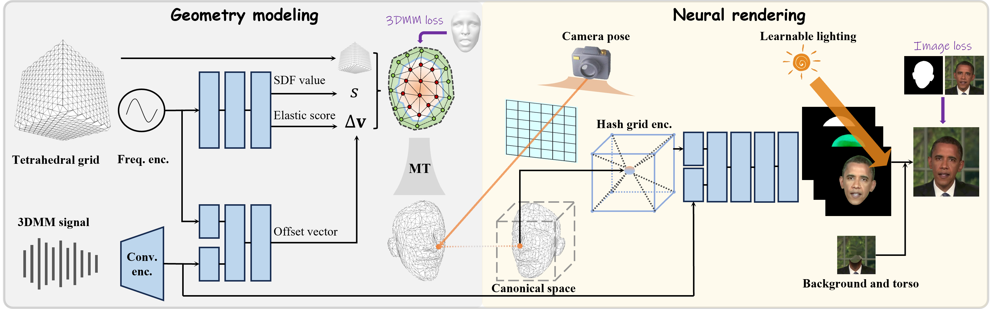

# Learning Dynamic Tetrahedra for High-Quality Talking Head Synthesis 
This repository contains a PyTorch re-implementation of the paper: Learning Dynamic Tetrahedra for High-Quality Talking Head Synthesis (CVPR 2024).
### | [Arxiv](https://arxiv.org/pdf/2402.17364.pdf) | [Video](https://youtu.be/Hahv5jy2w_E) | 


## Installation
Requires Python 3.6+, Cuda 11.3+ and PyTorch 1.10+. 

Tested in Linux and Anaconda3 with Python 3.9 and PyTorch 1.10.

Please refer to scripts/install.sh
````### Install dependency
conda create -n dyntet python=3.9
conda activate dyntet
conda install pytorch torchvision torchaudio cudatoolkit=11.6 -c pytorch -c conda-forge
pip install ninja imageio PyOpenGL glfw xatlas gdown
pip install git+https://github.com/NVlabs/nvdiffrast/
pip install git+https://github.com/facebookresearch/pytorch3d/
pip install --global-option="--no-networks" git+https://github.com/NVlabs/tiny-cuda-nn#subdirectory=bindings/torch
pip install scikit-learn configargparse face_alignment natsort matplotlib dominate tensorboard kornia trimesh open3d imageio-ffmpeg lpips easydict pysdf rich openpyxl gfpgan
```````

### Preparation 

The following steps refer to [AD-NeRF](https://github.com/YudongGuo/AD-NeRF).

- Prepare face-parsing model.

  ```bash
  wget https://github.com/YudongGuo/AD-NeRF/blob/master/data_util/face_parsing/79999_iter.pth?raw=true -O data_utils/face_parsing/79999_iter.pth
  ```

- Prepare the 3DMM model for head pose estimation.

  ```bash
  wget https://github.com/YudongGuo/AD-NeRF/blob/master/data_util/face_tracking/3DMM/exp_info.npy?raw=true -O data_utils/face_tracking/3DMM/exp_info.npy
  wget https://github.com/YudongGuo/AD-NeRF/blob/master/data_util/face_tracking/3DMM/keys_info.npy?raw=true -O data_utils/face_tracking/3DMM/keys_info.npy
  wget https://github.com/YudongGuo/AD-NeRF/blob/master/data_util/face_tracking/3DMM/sub_mesh.obj?raw=true -O data_utils/face_tracking/3DMM/sub_mesh.obj
  wget https://github.com/YudongGuo/AD-NeRF/blob/master/data_util/face_tracking/3DMM/topology_info.npy?raw=true -O data_utils/face_tracking/3DMM/topology_info.npy
  ```

- Download 3DMM model from [Basel Face Model 2009](https://faces.dmi.unibas.ch/bfm/main.php?nav=1-1-0&id=details):

  ```
  # 1. copy 01_MorphableModel.mat to data_util/face_tracking/3DMM/
  # 2. cd data_utils/face_tracking && python convert_BFM.py
  ```

In addition, the following steps refer to [Deep3DFace](https://github.com/sicxu/Deep3DFaceRecon_pytorch/tree/master). We use 3DMM coefficients to drive talking heads.


[//]: # (- Get access to BFM09 using this [link]&#40;https://faces.dmi.unibas.ch/bfm/main.php?nav=1-2&id=downloads&#41;. After getting the access, download "01_MorphableModel.mat". Download the Expression Basis &#40;Exp_Pca.bin&#41; using this [link &#40;google drive&#41;]&#40;https://drive.google.com/file/d/1bw5Xf8C12pWmcMhNEu6PtsYVZkVucEN6/view?usp=sharing&#41;. Organize all files into the following structure:)

[//]: # (```)

[//]: # (data_utils)

[//]: # (©¦)

[//]: # (©¸©¤©¤©¤Deep3DFaceRecon)

[//]: # (    ©¦)

[//]: # (    ©¸©¤©¤©¤ BFM)

[//]: # (        ©¦)

[//]: # (        ©¸©¤©¤©¤ 01_MorphableModel.mat)

[//]: # (        ©¦)

[//]: # (        ©¸©¤©¤©¤ Exp_Pca.bin)

[//]: # (        |)

[//]: # (        ©¸©¤©¤©¤ ...)

[//]: # (```)


- Download the pre-trained model using this [link (google drive)](https://drive.google.com/drive/folders/1liaIxn9smpudjjqMaWWRpP0mXRW_qRPP?usp=sharing) and organize the directory into the following structure:
```
data_utils
│
└───Deep3DFaceRecon
    │
    └─── checkpoints
        │
        └─── facerecon
            │
            └─── epoch_20.pth
```

For evaluation, download the pre-trained model [arcface model](https://link.zhihu.com/?target=https%3A//1drv.ms/u/s%21AhMqVPD44cDOhkPsOU2S_HFpY9dC) and organize the directory into the following structure:
```
evaluate_utils
│
└───arcface
    │
    └─── model_ir_se50.pth
```

## Usage

### Pre-processing
* Put training video under `data/video/<ID>.mp4`
  - The video must be 25FPS, with all frames containing the talking person. 
  - Due to the usage of nvdiffrast, we will process video width and height into integers multiple of 8, like 448\*448 and 512\*512.

  We get the experiment videos mainly from [AD-NeRF](https://github.com/YudongGuo/AD-NeRF), [ER-NeRF](https://github.com/Fictionarry/ER-NeRF), [GeneFace](https://github.com/yerfor/GeneFace) and YouTube. Due to copyright restrictions, we can't distribute all of them. You may have to download and crop these videos by youself. Here is an example training video (Obama) from AD-NeRF.
  ```
  mkdir -p data/video
  wget https://github.com/YudongGuo/AD-NeRF/blob/master/dataset/vids/Obama.mp4?raw=true -O data/video/obama.mp4
  ```
* Run script to process the video. (may take several hours)

  ```bash
  python data_utils/process.py --path "data/video/obama.mp4" --save_dir "data/video/obama" --task -1
  ```

### Train
To train the model on the Obama video:
```bash
python train.py --config configs/obama.json
```

### Evaluation
To evaluate the trained model on the validation dataset:

```bash
python evaluate_utils/evaluate.py --train_dir out/obama
```


### Inference

To infer the video of validation dataset:
```bash
python infer.py --config configs/obama.json 
```
To infer the video with customized 3DMM coefficients, and (optionally) merge the video and audio:
```bash
python infer.py --config configs/obama.json --drive_3dmm data/test_audio/obama_sing_sadtalker.npy --audio data/test_audio/sing.wav
```

Note: Given an audio (e.g., `AUDIO.wav`), you can try [SadTalker](https://github.com/OpenTalker/SadTalker)  to generate the 3DMM coefficients mat file (e.g., `FILE.mat`) , then run 
```
python infer.py --config configs/obama.json --drive_3dmm FILE.mat --audio AUDIO.wav
```

## TODO
- [x] **Release Code.**
- [ ] We consider that uploading a script that fine-tunes GFPGAN on DynTet to enhance the visual effects of talking head. 

## Citation

Consider citing as below if you find this repository helpful to your project:

```
@InProceedings{zhang2024learning,
    title={Learning Dynamic Tetrahedra for High-Quality Talking Head Synthesis}, 
    author={Zicheng Zhang and Ruobing Zheng and Ziwen Liu and Congying Han and Tianqi Li and Meng Wang and Tiande Guo and Jingdong Chen and Bonan Li and Ming Yang},
    booktitle={CVPR},
    year={2024}
}
```

## Acknowledgements

This code is developed heavily relying on [AD-NeRF](https://github.com/ashawkey/RAD-NeRF) for data processing, [nvdiffrec](https://github.com/NVlabs/nvdiffrec) for Marching Tetrahedra, [Deep3DFace](https://github.com/sicxu/Deep3DFaceRecon_pytorch/tree/master) for 3DMM extraction.
Some of the code is drawn from [OTAvatar](https://github.com/theEricMa/OTAvatar), [RAD-NeRF](https://github.com/ashawkey/RAD-NeRF) and [ER-NeRF](https://github.com/Fictionarry/ER-NeRF). Thanks for these great projects. Please follow the license of the above open-source code
